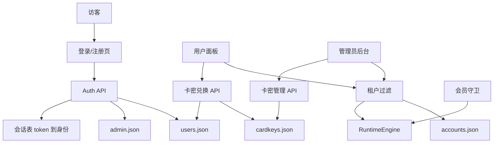

# 用户系统与卡密系统

Feature Name: user-cardkey-system
Updated: 2026-09-20

## Description

将现有单一超级管理员面板扩展为多用户租户：普通用户可注册、登录、兑换卡密，并仅管理自己的游戏账号；管理员可开关注册与卡密领取，生成时间卡密和额度卡密，查看全站游戏账号及其归属。数据继续使用 `data/` 下的 JSON 文件持久化，鉴权从“匿名令牌集合”升级为“带身份的会话”。

## Architecture



请求路径：

1. 公开接口：`/api/login`、`/api/register`、`/api/game-version`、`/api/public/auth-config`
2. 登录后所有 `/api/*` 走会话鉴权，从会话取出 `role` 与 `userId`
3. 游戏账号读写先按归属过滤；管理员跳过过滤
4. 用户新增账号、启动自动化前检查会员有效期和槽位
5. 卡密兑换在单次写文件过程中完成“校验、标记已用、更新用户权益”

## Components and Interfaces

### 1. Auth Session

现有 `AdminContext.tokens: Set<string>` 只证明“有人登录过”。改为：

```ts
interface SessionRecord {
  token: string
  role: 'admin' | 'user'
  userId: string
  username: string
  createdAt: number
}
```

- `userId` 对管理员固定为 `admin`
- HTTP 中间件把会话写入 `req.auth`
- Socket.IO 握手同样绑定会话，普通用户只能订阅自己的 `account:*` 房间
- 改密、禁用用户时删除该身份下全部会话

### 2. User Store (`core/src/models/user-store.ts`)

职责：用户 CRUD、密码校验、会员与槽位读写、启用/禁用。

对外方法：

- `registerUser(username, password)`
- `validateUser(username, password, ip)`
- `getUserPublic(userId)`
- `changeUserPassword(userId, oldPassword, newPassword)`
- `extendMembership(userId, days)`
- `addQuota(userId, slots)`
- `listUsers()`
- `updateUserEntitlement(userId, patch)`
- `setUserEnabled(userId, enabled)`
- `countOwnedAccounts(userId)`

密码哈希复用 `auth-security.ts` 的 PBKDF2。普通用户密码只要求非空，不做长度和复杂度校验。登录失败锁定按用户名分桶，管理员继续使用现有 `admin` 桶，管理员改密仍走现有强度规则。

### 3. Card Key Store (`core/src/models/cardkey-store.ts`)

职责：生成、查询、作废、兑换。兑换必须同步、按卡密码加锁（进程内互斥 + 读改写同一文件），避免同一张卡被并发兑换两次。

对外方法：

- `createCardKeys({ type, value, count })` 数量为正整数即可，不设上限
- `listCardKeys(filter)`
- `voidCardKey(code)`
- `redeemCardKey(userId, code)`
- `listUserRedeems(userId)`

卡密明文格式：`QF` + 20 位大写字母数字，生成时做唯一性重试。

### 4. Auth Config Store

注册开关与卡密领取开关写入 `data/auth-config.json`：

- `registrationEnabled: boolean` 默认 `false`
- `cardClaimEnabled: boolean` 默认 `false`

首次启动保持关闭，避免公网暴露后被随意注册。

### 5. Account Ownership

`accounts.json` 中每个游戏账号增加 `ownerUserId: string`。

- 迁移：缺失字段的账号写为 `admin`
- `getAccounts()` 按调用方角色过滤
- `addOrUpdateAccount` 写入当前用户 `ownerUserId`，禁止普通用户改归属
- 槽位统计只计算该 `ownerUserId` 的账号数
- 管理员账号数量和会员时间不做限制

### 6. Membership Guard

在以下入口检查：

- `POST /api/accounts` 创建账号
- `provider.startAccount` / `restartAccount`
- RuntimeEngine 启动或恢复 worker 时

规则：

- 管理员：直接放行
- 用户会员未开通或已过期：拒绝新增账号，停止已有 worker
- 用户已用槽位达到上限：拒绝新增，已有账号可继续运行（会员有效时）
- 管理员禁用用户：停止该用户全部 worker 并清除会话

后台定时（60 秒）扫描过期用户并停止其 worker。

### 7. HTTP Routes

公开：

- `GET /api/public/auth-config` 返回 `{ registrationEnabled }`
- `POST /api/register` `{ username, password }`
- `POST /api/login` 同时校验管理员与普通用户

用户：

- `GET /api/user/me` 增加 `role`、`membershipExpiresAt`、`slotLimit`、`slotUsed`、`enabled`
- `POST /api/user/change-password`
- `POST /api/cardkeys/redeem` `{ code }`
- `GET /api/cardkeys/my-redeems`

管理员：

- `GET /api/admin/auth-config`
- `PUT /api/admin/auth-config`
- `GET /api/admin/users`
- `PATCH /api/admin/users/:id` 调整到期时间、槽位、启用状态
- `POST /api/admin/cardkeys` `{ type: 'time' | 'quota', value, count }`
- `GET /api/admin/cardkeys`
- `POST /api/admin/cardkeys/:code/void`

现有挂机 API 保持路径不变，由中间件注入身份并做租户过滤。管理员专属系统设置接口在角色不是 `admin` 时返回 403。

### 8. Frontend

登录页：

- 拉取 `registrationEnabled`，开启时显示注册入口
- 文案从“超级管理员登录”改为按角色展示

用户侧：

- 设置页增加“会员与卡密”分区：到期时间、槽位、兑换输入框、兑换记录
- 会员过期时账号管理只读，启动挂机按钮禁用
- 侧栏账号下拉仅显示自己的游戏账号

管理员侧：

- 新增菜单“用户与卡密”
- 页面含：注册/领取开关、用户列表、生成卡密、卡密列表与作废
- 游戏账号列表展示归属用户名

路由：管理员菜单对普通用户隐藏；直接访问返回设置页或 403 提示。

## Data Models

### UserRecord

```ts
interface UserRecord {
  id: string
  username: string
  password: string
  role: 'user'
  enabled: boolean
  membershipExpiresAt: number | null
  slotLimit: number
  createdAt: number
  updatedAt: number
}
```

文件：`data/users.json`

```json
{ "users": [], "nextId": 1 }
```

新用户默认：`membershipExpiresAt = null`，`slotLimit = 2`，`enabled = true`。

### CardKeyRecord

```ts
type CardKeyType = 'time' | 'quota'
type CardKeyStatus = 'unused' | 'used' | 'voided'

interface CardKeyRecord {
  code: string
  type: CardKeyType
  value: number
  status: CardKeyStatus
  createdAt: number
  usedAt?: number
  usedByUserId?: string
  usedByUsername?: string
  voidedAt?: number
}
```

- `time` 的 `value` 为正整数天数
- `quota` 的 `value` 为正整数槽位数
- 文件：`data/cardkeys.json`

### AuthConfig

```ts
interface AuthConfig {
  registrationEnabled: boolean
  cardClaimEnabled: boolean
  updatedAt: number
}
```

### Account 增量字段

```ts
interface Account {
  ownerUserId: string
}
```

兼容：读取时若无该字段，视为 `admin` 并回写。

### Session

会话保存在进程内存。进程重启后需重新登录，与当前令牌行为一致。

## Correctness Properties

- 同一张卡密最多被标记为 `used` 一次
- 时间卡密兑换：未开通或已过期从当前时刻起算；未过期从现有到期时间累加
- 额度卡密兑换要求 `membershipExpiresAt > now`
- 普通用户 `slotUsed <= slotLimit` 时才能新增游戏账号；超限后已有账号保留
- 普通用户只能读写 `ownerUserId === 自己 id` 的游戏账号
- 管理员不受会员和槽位限制
- 禁用或过期用户的 worker 在检查周期内被停止
- 注册开关关闭时 `POST /api/register` 返回失败
- 领取开关关闭时兑换接口返回失败且卡密状态不变
- 已使用卡密不可作废；作废卡密不可兑换

## Error Handling

| 场景 | HTTP | 提示 |
| --- | --- | --- |
| 注册未开放 | 403 | 注册未开放 |
| 用户名已存在 | 409 | 用户名已被占用 |
| 登录失败 | 401 | 用户名或密码错误 |
| 账号禁用 | 403 | 账号已被禁用 |
| 领取未开放 | 403 | 卡密领取未开放 |
| 卡密无效/已用/已作废 | 400 | 卡密无效或已被使用 |
| 先兑额度未开通会员 | 400 | 请先兑换时间卡密开通会员 |
| 槽位不足 | 400 | 账号槽位不足 |
| 会员过期仍新增/启动 | 403 | 会员已过期，请兑换时间卡密 |
| 普通用户访问管理接口 | 403 | 需要管理员权限 |
| 访问他人游戏账号 | 404 | Account not found |

卡密生成失败（数量非法、面值非正整数）返回 400。文件写入失败返回 500，兑换事务以写盘成功为准。

## Test Strategy

后端单测（`core/tests/`）：

1. 注册开关开/关
2. 默认槽位为 2、会员为空
3. 时间卡密：过期用户从现在起算，有效用户累加
4. 额度卡密：无会员拒绝；有会员增加槽位
5. 同一卡密并发兑换仅成功一次
6. 作废未使用卡密成功，作废已使用卡密失败
7. 账号列表按 `ownerUserId` 过滤
8. 存量账号迁移为归属 `admin`
9. 过期用户 `startAccount` 被拒绝
10. 槽位用尽后拒绝新增、保留已有账号

前端：登录页注册入口随开关显示；用户页展示到期时间和兑换框；管理员页仅 `role === 'admin'` 可见。

## References

[^1]: (Filename) - 现有管理员存储 `core/src/models/admin-store.ts`
[^2]: (Filename) - 现有登录鉴权 `core/src/controllers/admin/auth-routes.ts`
[^3]: (Filename) - 令牌中间件 `core/src/controllers/admin/middleware.ts`
[^4]: (Filename) - 游戏账号存储 `core/src/models/store/accounts.ts`
[^5]: (Filename) - 需求文档 `.monkeycode/specs/user-cardkey-system/requirements.md`
